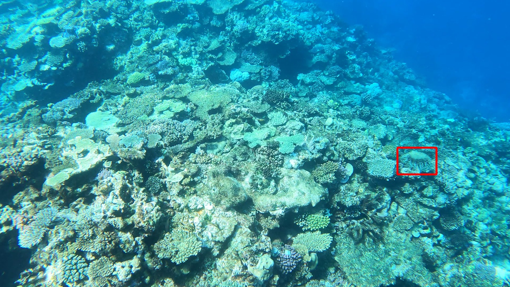

# Crown-of-Thorns Starfish Detection

## Overview
This repository contains code related to developing an automated pipeline for detecting Crown-of-Thorns Starfish (COTS) in underwater images from the Great Barrier Reef. COTS outbreaks pose a significant threat to coral ecosystems, and early detection is crucial for conservation efforts. 

The dataset comes from the [Kaggle TensorFlow Great Barrier Reef competition](https://www.kaggle.com/competitions/tensorflow-great-barrier-reef/overview), consisting of thousands of labeled underwater images.

This project is in completion of STA 2453 at the Department of Statistical Sciences at the University of Toronto, S2025.

## Repository Structure
The key directories to be aware of are listed below. Note that the the data folder is not included in this repository due to its large size. It is the result of restructuring the original Kaggle dataset (see `/data_processing/...`). Please see `toc.txt` to see a detailed outline of the repository strcuture.

```
cots/ 
├── global_paths.py     # Centralized path configuration 
├── README.md           # Project documentation 
├── toc.txt             # Text outline of repository structure
├── requirements.txt    # Required libraries
├── data/               # Training, validation, test sets, and labels 
├── data_processing/    # Scripts for annotation formatting and directory structuring 
├── model/              # Training, prediction, and evaluation scripts 
```

## Sample Image
Below is an example of a COTS from an image in the dataset, where a red bounding box highlights the starfish:

